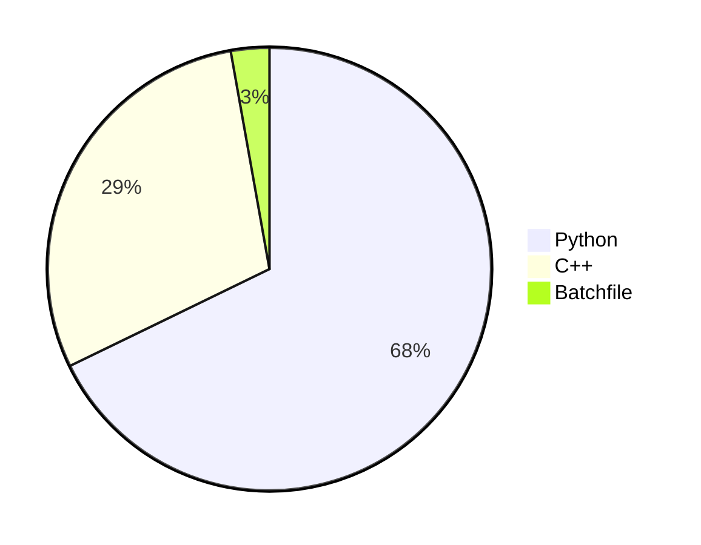

<h1> 
WinSecurityProject 
</h1>


<!--  -->


## Overview
+  WinSecurity is a robust toolset meticulously designed to fortify the security of your local sensitive data on Windows systems. By preventing unauthorized activities such as Automatic Sample Submission, managing Delivery Optimization Download Mode, and monitoring third-party software activities, WinSecurity empowers users with a comprehensive suite of protective features.
#### Key Features 
+ WinSecurity implements a sophisticated mechanism to manage and control the automatic submission of sensitive data samples. This ensures user consent, preventing any unauthorized sharing of critical information.
#### Delivery Optimization Download Mode Management
+ Take control of the Windows Delivery Optimization Download Mode with WinSecurity. This feature allows users to monitor and regulate the downloading of updates, minimizing data exposure and enhancing control over system updates.
#### Third-Party Software Activity Monitoring
+ WinSecurity establishes a comprehensive monitoring system to detect and restrict unauthorized activities performed by third-party software, with a specific focus on preventing unauthorized file modifications. Your data's integrity is prioritized and safeguarded against potential threats.
#### Folder Content Summary
+ Get a quick overview of your directory's content with WinSecurity's Folder Content Summary feature. This allows users to efficiently assess files and their types within a specified directory, streamlining the process of data management.
#### Folder Details View
+ Delve deeper into folder details with WinSecurity's Folder Details View. This feature offers a comprehensive insight into file attributes, permissions, and other relevant information. Users are empowered to make informed decisions about their data security based on a thorough understanding of folder specifics.
#### Windows Toast Notifications
+ WinSecurity implements a non-intrusive notification system using Windows toast notifications. This ensures that users are promptly alerted about critical events or potential security breaches without disrupting their workflows. Stay informed and in control of your system's security effortlessly.


## Installation

### Step 1: Install Python

- Make sure you have Python installed on your system. If not, you can download it from [Python's official website](https://www.python.org/).


### Step 2: Install Required Python Modules

```bash
pip install Customtkinter image ctktable Packaging Humanize
```


<!-- install python
import Customtkinter, image, ctktable, Packaging, Humanize python modules
install gcc c/c++ compiler
run the compile.bat file
run the security.py with admin previlage. -->


### Step 3: Install GCC C/C++ Compiler
- Ensure you have the GCC C/C++ compiler installed on your system. You can download it from MinGW or any other suitable source.


### Step 4: Compile the Project
- Run the following command in the terminal or command prompt:
```bash
compile.bat
```


### Step 5: Run the Application
- Execute the following command with admin privileges:
```bash
python security_project.py
```


<details>
  <summary>  <h2>  Screenshots  </h2>  </summary>

  
  
  
   
  
  


  
</details>

## Programming Languages




## License
- This project is licensed under the MIT License

>Copyright (c) 2023 SAMITHA
>
>Permission is hereby granted, free of charge, to any person obtaining a copy
>of this software and associated documentation files (the "Software"), to deal
>in the Software without restriction, including without limitation the rights
>to use, copy, modify, merge, publish, distribute, sublicense, and/or sell
>copies of the Software, and to permit persons to whom the Software is
>furnished to do so, subject to the following conditions:
>
>The above copyright notice and this permission notice shall be included in all
>copies or substantial portions of the Software.
>
>THE SOFTWARE IS PROVIDED "AS IS", WITHOUT WARRANTY OF ANY KIND, EXPRESS OR
>IMPLIED, INCLUDING BUT NOT LIMITED TO THE WARRANTIES OF MERCHANTABILITY,
>FITNESS FOR A PARTICULAR PURPOSE AND NONINFRINGEMENT. IN NO EVENT SHALL THE
>AUTHORS OR COPYRIGHT HOLDERS BE LIABLE FOR ANY CLAIM, DAMAGES OR OTHER
>LIABILITY, WHETHER IN AN ACTION OF CONTRACT, TORT OR OTHERWISE, ARISING FROM,
>OUT OF OR IN CONNECTION WITH THE SOFTWARE OR THE USE OR OTHER DEALINGS IN THE
>SOFTWARE.


